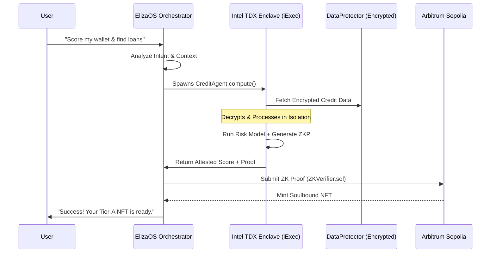
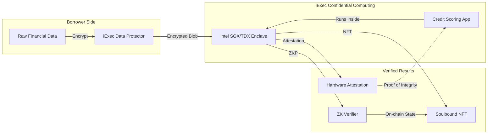

# CredTrust: Privacy-Preserving Credit Marketplace

> Built with [Lovable](https://lovable.dev) for the **Hack4Privacy** hackathon

CredTrust is a high-fidelity, privacy-preserving credit marketplace protocol that combines **iExec Trusted Execution Environments (TEE)**, **Zero-Knowledge Proofs (ZKP)**, and **Risk-Tranching Smart Contracts** to enable institutional-grade credit underwriting on **Arbitrum Sepolia** while maintaining absolute borrower data sovereignty.

## 🚀 ElizaOS + Intel TDX Integration (Hack4Privacy Ultimate Edition)

CredTrust-3 has been transformed from a static dashboard into an **Autonomous Agentic Masterpiece** running in **Intel TDX** via iExec.

### 🎯 Features
- ✅ **ElizaOS Framework**: Autonomous agents with persistent memory and reasoning.
- ✅ **Intel TDX Confidentiality**: Full isolation for sensitive credit scoring logic via hardware-level encryption.
- ✅ **Autonomous Credit Management**: 24/7 portfolio monitoring and loan execution.
- ✅ **Multi-platform Support**: Integrated with Discord, Telegram, and X.
- ✅ **Claude MCP Ready**: Use Claude to manage your TDX agents.

### 🏗️ Agentic Architecture


### 🛠️ Quick Start (Agent Mode)
```bash
# Start ElizaOS development mode
npm run elizaos:dev

# Build and deploy the TDX agent to iExec
npm run tdx:deploy

# Run the full hackathon demo stack
npm run hackathon:demo
```

### 📁 Agent Structure
- `src/agents/credtrust-agent.character.json`: Agent personality and goals.
- `src/agents/eliza-credit-agent.ts`: Core scoring and monitoring logic.
- `tdx/Dockerfile.tdx`: Specialized container for Intel TDX execution.
- `src/app/elizaos/page.tsx`: Live agent dashboard.

## 🔐 Privacy-First Workflow (Technical Deep Dive)

CredTrust ensures **Data Sovereignty** by never exposing raw financial data to any party, including the orchestrator.

### 🛡️ Data Sovereignty Diagram


## 🔥 iExec Hack4Privacy Features

CredTrust-3 is now supercharged with advanced iExec features:

- **Interactive TEE Demo**: Full lifecycle visualization of a privacy-preserving credit score computation. [Live Demo](/iexec-demo)
- **Bulk Processing**: Score hundreds of users simultaneously using parallel TEE jobs.
- **Web3Mail/Telegram**: Confidential notifications sent via iExec Web3Mail without exposing user contact info.
- **Account Abstraction**: Gasless TEE requests sponsored by iExec Paymaster.
- **Monetization**: Data providers can monetize their datasets using iExec Data Protector's signed orders.

### 📩 Confidential Messaging Workflow
```mermaid
graph TD
    User[User Address] -->|Protects| Email[user@example.com]
    Email -->|Becomes| PD[Protected Data 0xabc...]
    PD -->|Grant Access| App[CredTrust Web3Mail App]
    App -->|Send| Msg[Confidential Message]
    Msg -->|Through| SGX[iExec SGX Enclave]
    SGX -->|Delivers| Inbox[User's Physical Email]
    
    style SGX fill:#f96,stroke:#333,stroke-width:4px
```

## 🛠️ Tech Stack

- **Framework**: React 18, TypeScript, Vite
- **Confidential Computing**: iExec SDK (Data Protector, Web3Mail, TEE)
- **Agent Framework**: ElizaOS (TDX Integrated)
- **ZKP**: SnarkJS / Groth16 (Generated in TEE)
- **Smart Contracts**: Solidity (Arbitrum Sepolia)
- **UI Components**: shadcn/ui, Radix UI, Framer Motion

## 📁 Project Structure

```bash
├── agents/             # ElizaOS agent configurations
├── contracts/          # Solidity ZK Verifiers & NFT contracts
├── scripts/            
│   ├── web3-messaging/ # Web3Mail & Telegram scripts
│   ├── dataprotector/  # Data monetization scripts
│   └── setup-hackathon.sh
├── src/
│   ├── agents/         # TDX Agent logic
│   ├── components/     # React UI (TEE Workflow, Monitors)
│   ├── lib/            # iExec & Web3 utilities
│   └── wallet/         # Multi-chain provider setup
└── tdx/                # Intel TDX Docker configuration
```

## 💰 Risk Tranching

| Tier | Score Range | Interest Rate | Max LTV | On-chain Credential |
|------|-------------|---------------|---------|-------------------|
| **A** | 750+ | 4.5% | 85% | `CredProofNFT_A` |
| **B** | 700-749 | 8.0% | 70% | `CredProofNFT_B` |
| **C** | 650-699 | 12.5% | 50% | `CredProofNFT_C` |
| **D** | <650 | 22.0% | 30% | `CredProofNFT_D` |

## 🤝 Contributing

This project uses Lovable's bidirectional GitHub sync. Changes made in Lovable automatically push to GitHub, and vice versa.

## 📄 License

© 2026 CredTrust Protocol. Built for Hack4Privacy.


### Run iApp with ProtectedData (CredTrust)

This repo includes scripts & UI to start iExec iApp runs that consume ProtectedData (DataProtector).

- CLI: `scripts/iapp/run_iapp_with_protected_data.ts`
- Fetch results: `scripts/iapp/get_task_result.ts`
- Frontend demo: `src/components/IAppRunner.tsx` (posts to `/api/iapp/run`)

Run (dev):
1. Copy `.env.example` -> `.env` and set `DEV_MODE=true`.
2. `npm ci`
3. Create sample ProtectedData (see other scripts).
4. Submit run and fetch results.
