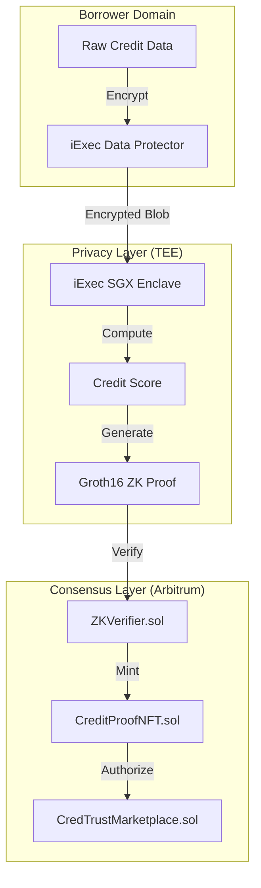

# CredTrust: Privacy-Preserving Credit Marketplace

> Built with [Lovable](https://lovable.dev) for the **Hack4Privacy** hackathon

CredTrust is a high-fidelity, privacy-preserving credit marketplace protocol that combines **iExec Trusted Execution Environments (TEE)**, **Zero-Knowledge Proofs (ZKP)**, and **Risk-Tranching Smart Contracts** to enable institutional-grade credit underwriting on **Arbitrum Sepolia** while maintaining absolute borrower data sovereignty.

## 🚀 Quick Start

```bash
# Install dependencies
npm install

# Start development server
npm run dev
```

Visit [http://localhost:8080](http://localhost:8080) to view the app.

## 🛠️ Tech Stack

- **Frontend**: React 18, TypeScript, Vite, Tailwind CSS
- **UI Components**: shadcn/ui, Radix UI, Framer Motion
- **Web3**: wagmi, viem, RainbowKit
- **Charts**: Recharts
- **State**: Zustand, TanStack Query

## 📁 Project Structure

```
├── src/
│   ├── components/     # React components
│   │   ├── ui/         # shadcn/ui components
│   │   ├── landing/    # Landing page sections
│   │   └── ...         # Feature components
│   ├── hooks/          # Custom React hooks
│   ├── lib/            # Utility functions
│   ├── pages/          # Page components
│   ├── wallet/         # Web3 wallet provider
│   └── types/          # TypeScript types
├── contracts/          # Solidity smart contracts
├── scripts/            # Deployment scripts
└── public/             # Static assets
```

## 🔐 How CredTrust Works

1. **Ingestion**: Borrowers encrypt data client-side using iExec Data Protector
2. **Processing**: An iExec SGX Enclave computes the credit score in isolation
3. **Verification**: The TEE generates a Groth16 ZK Proof for risk tier verification
4. **Settlement**: On-chain verifiers validate the ZKP and mint a Soulbound NFT credential

## 🏗️ Architecture



## 💰 Risk Tranching

| Tier | Score Range | Interest Rate | Max LTV |
|------|-------------|---------------|---------|
| **A** | 750+ | 4.5% | 85% |
| **B** | 700-749 | 8.0% | 70% |
| **C** | 650-699 | 12.5% | 50% |
| **D** | <650 | 22.0% | 30% |

## 🔧 Environment Variables

Create a `.env` file for local development:

```env
VITE_WALLETCONNECT_PROJECT_ID=your_project_id
VITE_BACKEND_URL=http://localhost:4000
```

## 📦 Deployment

### Lovable (Recommended)
Simply click **Share → Publish** in the Lovable editor.

### Manual Deployment
```bash
npm run build
# Deploy the dist/ folder to your hosting provider
```

## 🤝 Contributing

This project uses Lovable's bidirectional GitHub sync. Changes made in Lovable automatically push to GitHub, and vice versa.

## 📄 License

© 2026 CredTrust Protocol. Built for Hack4Privacy.
